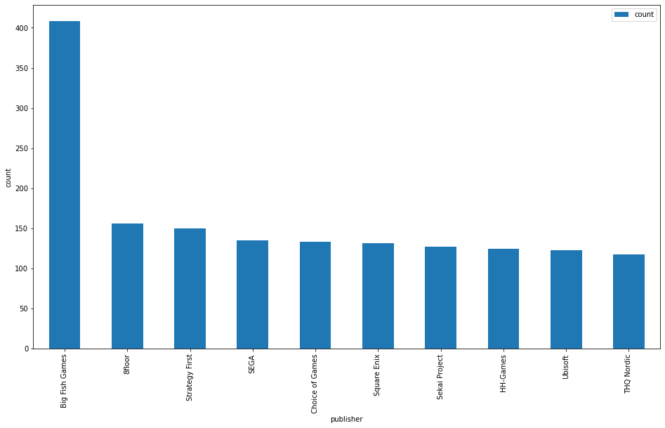
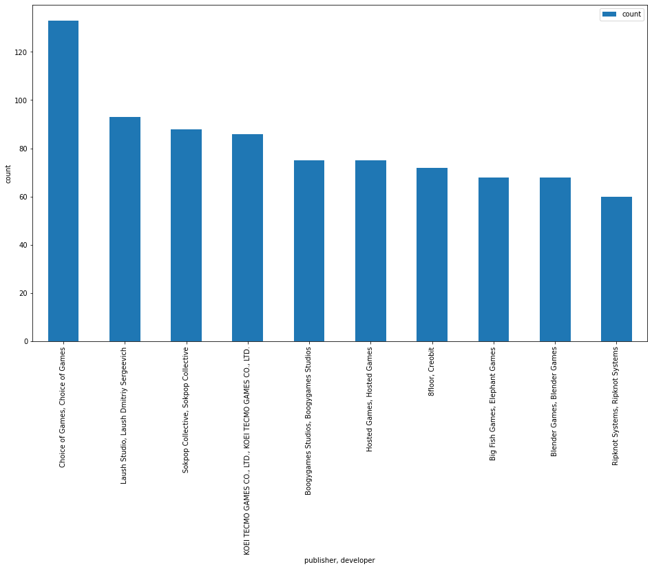
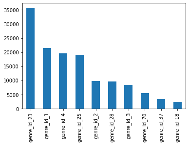
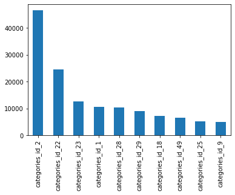
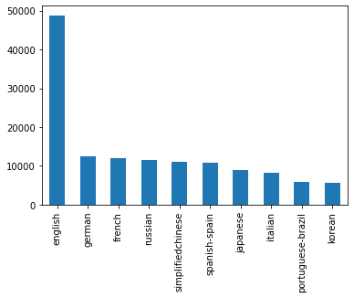
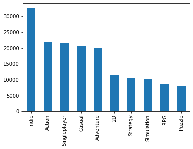
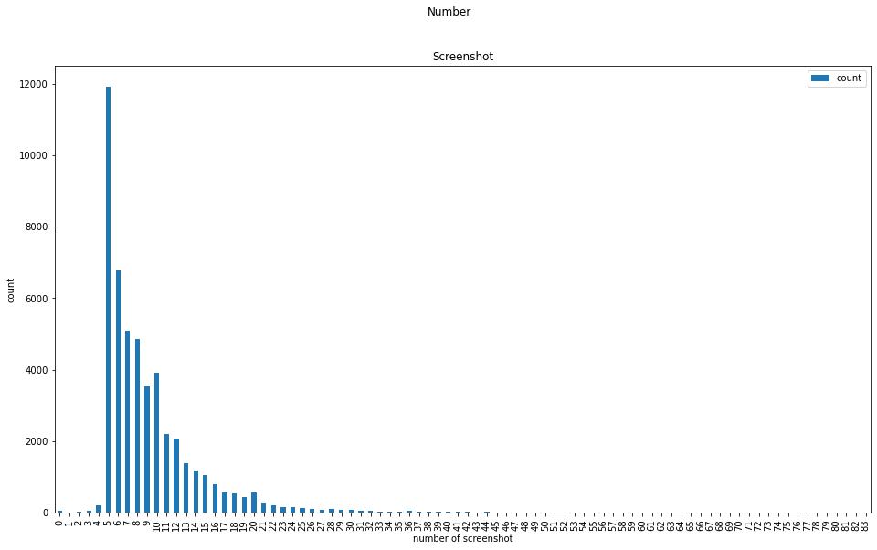
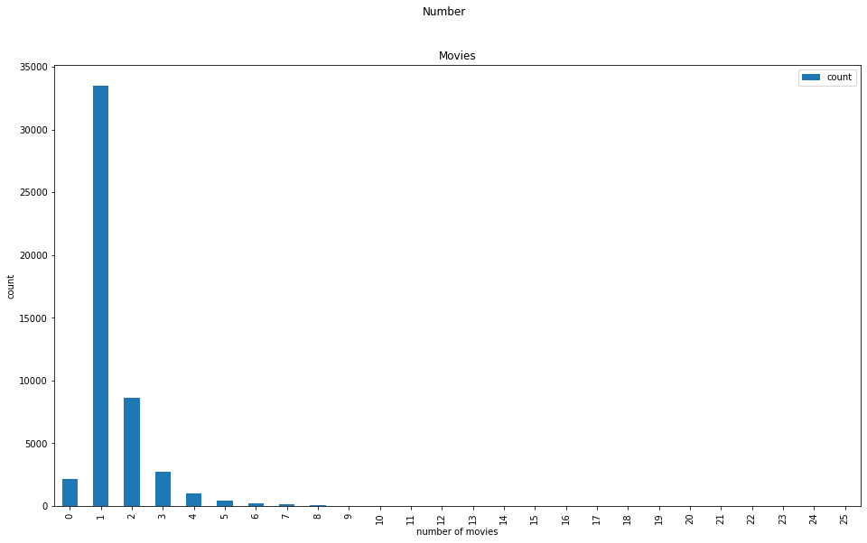
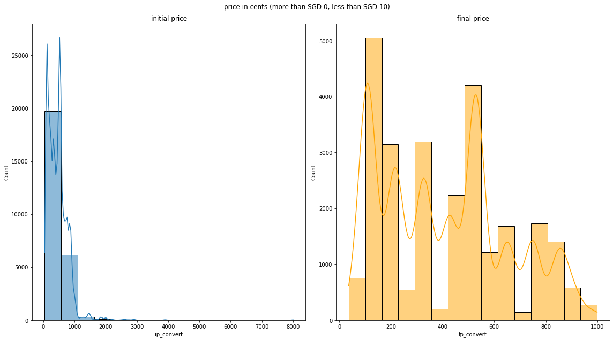
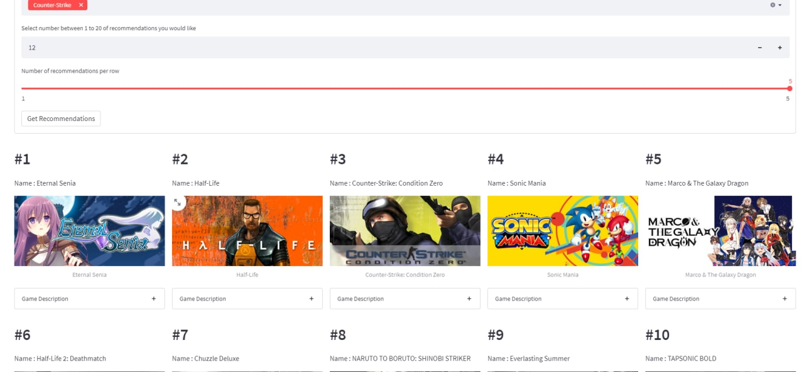

# Capstone - Games Recommender

## Background

During 2020, Steam had set new records amid global lockdowns, with more than 50% hours played by users compared to 2019.  ([link](https://store.steampowered.com/news/group/4145017/view/2961646623386540826))

Even Singapore observed a rise in the sales of Video Games. ([StraitTimes](https://www.straitstimes.com/tech/tech-news/video-games-sales-level-up-in-singapore-in-2020-as-covid-19-outbreak-keeps-people))

For my final project with General Assembly, I decided to do a game recommender using the games from steam.

## Problem Statement

We will aim to perform EDA on the data to identify the top genres and categories within the games extracted. We will build a game recommender based on the extracted data.

## Data Dictionary

Can be found in [database.md](./database.md)

### Database Schema:

Image created using: https://dbdiagram.io/

## EDA

### Developer
Top 10 game publishers on steam:

Top 10 game publisher and developer on steam:

### Genre and Categories
Top 10 genre released on steam:

Top 10 Category released on steam:

<b><u>Table of names of top 10</b></u>

| Rank | Genre | Category |
|- |-|-|
|1| Indie | Single-player|
|2| Action | Steam Achievements|
|3| Casual | Steam Cloud|
|4| Adventure | Multi-player|
|5| Strategy | Full Controller Support|
|6| Simulation | Steam Trading Cards |
|7| RPG | Partial Controller Support|
|8| Early Access | PvP|
|9| Free to Play | Steam Leaderboards|
|10| Sports | Co-op|

### language
Top 10 language released on steam:

### Tag
Top 10 User defined tag released on steam:

### Media
Plot to see number of screenshots used as promotional media

Plot to see number of movies used as promotional media

Peak is 5 screenshot and 1 movie.

### Price

Price of games below SGD 10. *Plot in cents*

We see that a fair number of games are on discount that allows the final price to fall below SGD 10.

## Recommender

We build the recommender using the following information
1. Game description *(CountVectorized)*
2. Weighted Average *(calculation)*
3. Genre
4. Categories
5. Language
6. Games that have average playtime above 0.

#### Calculation Weighted Average

For our calculation of weighted average, with 3 factors, we assigned weights from 1 to 3, depending on the importance of the value.

We will use the weighted average with the Mathematical formula as follows:

where
- P is the percentage positive review: () with the weight of 3 as this is the number of game reviews
- O is the midpoint estimate of number of owners: () with the weight of 1 as this is an estimate of number of owners
- F is the average_forever: with the weight of 2 as this is the average playtime since March 2009 in minutes.

### Streamlit Application

The final deployed recommender contains games that are still being played for the last 2 weeks (at point of extraction, Feb 2022), i.e. for games that have average_2weeks > 0 using streamlit.

**Link** : 
https://share.streamlit.io/mitchellec/ga_capstone/recommender_extract.py

**QR Code** :  

**Screenshot** :  

## Acknowledgement:
Much thanks to the API explaination / guide set out by Nik Davis in his GitHub ([link](https://nik-davis.github.io/posts/2019/steam-data-collection/)), which without I think I would have spent much longer time finding out how to get the data extracted from Steam and Steam Spy.

# Reference / Citation:
- Rise in Video games
  - https://store.steampowered.com/news/group/4145017/view/2961646623386540826
  - https://www.straitstimes.com/tech/tech-news/video-games-sales-level-up-in-singapore-in-2020-as-covid-19-outbreak-keeps-people
  - https://www.polygon.com/2020/3/23/21191397/steam-highest-active-player-record-coronavirus-covid-19
  - https://www.statista.com/statistics/1108322/covid-steam-users/
    
- Dataset API reference: https://www.kaggle.com/nikdavis/steam-store-games
- Dataset Game Review API reference: https://andrew-muller.medium.com/scraping-steam-user-reviews-9a43f9e38c92
- Data Dictionary for SteamStore: https://wiki.teamfortress.com/wiki/User:RJackson/StorefrontAPI
- DB multiple table:
  - https://www.sqlitetutorial.net/sqlite-python/create-tables/
  - https://runestone.academy/ns/books/published/py4e-int/database/multTables.html
  - https://www.tutorialspoint.com/sqlalchemy/sqlalchemy_core_using_multiple_tables.htm
  
- Recommender: https://www.datacamp.com/community/tutorials/recommender-systems-python

- Aproximate Nearest Neighbors:
https://pub.towardsai.net/knn-k-nearest-neighbors-is-dead-fc16507eb3e

- Rendering Math formula in markdown file: https://stackoverflow.com/questions/35498525/latex-rendering-in-readme-md-on-github

- Other Links:
  - https://developer.valvesoftware.com/wiki/Steam_Web_API
  - https://partner.steamgames.com/doc/webapi_overview
  - https://steamspy.com/about
