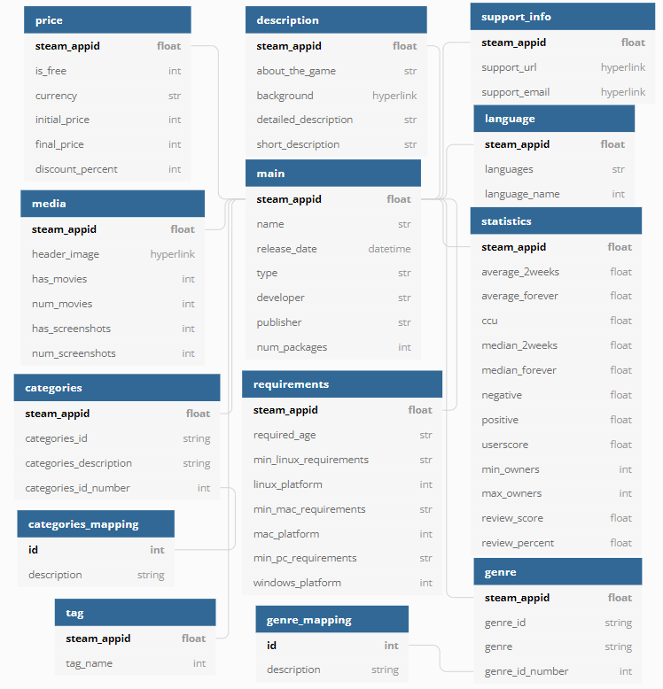

# Database

## Database Schema:

Image created using: https://dbdiagram.io/




## Data Dictionary:

Table: main
```
steam_appid   :   id of steam game [primary key]
name          :   name of steam game
release_date  :   release date of steam game
type          :   game or hardware
developer     :   developer of steam game
publisher     :   publisher of steam game
num_packages  :   number of game packages associated with the game
```

Table: genre
```
steam_appid     :   id of steam game [primary key]
genre_id        :   genres ids
genre           :   genre names
genre_id_number*:   indicator of id(s) for genre

* has more than 1 column
```

Table: genre_mapping
```
id          : id of genre [primary key]
description : name
```

Table: categories
```
steam_appid           :   id of steam game [primary key]
categories_id         :   categories ids
categories_description:   categories names
categories_id_number* :   indicator of id(s) for categories

* has more than 1 column
```

Table: categories_mapping
```
id          : id of category [primary key]
description : name
```

Table: description
```
steam_appid           :   id of steam game [primary key]
about_the_game        :   game description
background            :   hyperlink to background
detailed_description  :   detailed game description
short_description     :   short game description
```

Table: price
```
steam_appid     :   id of steam game [primary key]
is_free         :   indicate if game is free
currency        :   currency of price
initial_price   :   initial price of game
final_price     :   final price of game after discount
discount_percent:   discount made on game
```

Table: statistics
```
steam_appid     :   id of steam game [primary key]
average_2weeks  :   average playtime in the last two weeks. In minutes.
average_forever :   average playtime since March 2009. In minutes.
ccu             :   peak CCU yesterday. (on date of scrap)
median_2weeks   :   median playtime in the last two weeks. In minutes.
median_forever  :   median playtime since March 2009. In minutes.
negative        :   number of negative reviews
positive        :   number of positive reviews
userscore       :   user score rating
min_owners      :   lower range of estimate number of owners of this application on Steam
max_owners      :   upper range of estimate number of owners of this application on Steam
review_score    :   number of positive reviews - negative reviews
review_percent  :   review score percentage
```

Table: media
```
steam_appid     :   id of steam game [primary key]
header_image    :   hyperlink to header image
has_movies      :   indicator of  PV
num_movies      :   number of PV
has_screenshots :   indicator of image
num_screenshots :   number of PV
```

Table: requirements
```
steam_appid           :   id of steam game [primary key]
required_age          :   minimum age to play game
min_linux_requirements:   linux requirement for game play
linux_platform        :   indicator of linux compatibility
min_mac_requirements  :   mac requirement for game play
mac_platform          :   indicator of mac compatibility
min_pc_requirements   :   pc requirement for game play
windows_platform      :   indicator of windows compatibility
```

Table: language
```
steam_appid       :   id of steam game [primary key]
languages         :   list of languages
language_name*    :   indicator of the language

* has more than 1 column
```

Table: support_info
```
steam_appid   :   id of steam game [primary key]
support_url   :   url to game support
support_email :   email of game support
```

Table: tag
```
steam_appid :   id of steam game [primary key]
tag_name*   :   number of user defined for tag name

* has more than 1 column
```
